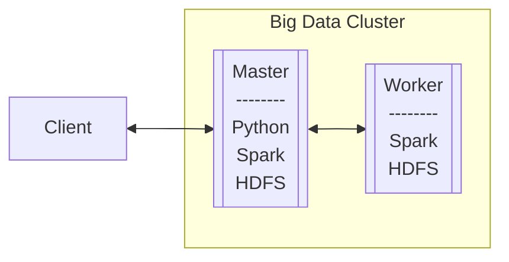

# SPARK DOCKER CLUSTER FOR BIG DATA & DATA SCIENCE <!-- omit in toc -->

This repository stores all the required components to build a containerized cluster for [Big Data] and [Data Science] applications. It allows scalable production services using technologies such as [Machine Learning] [Python] libraries, [Apache Spark] analytics engine, [Scala] language, [HDFS] and [Docker] containers among others.

- [DEPENDENCIES](#dependencies)
  - [PYTHON VIRTUAL ENVIRONMENT](#python-virtual-environment)
- [REPOSITORY CONTENT](#repository-content)
  - [WORK DIRECTORY CONTENT](#work-directory-content)
- [ARCHITECTURE](#architecture)
  - [CONTAINERIZED BIG DATA CLUSTER](#containerized-big-data-cluster)
  - [HOW TO RUN CONTAINERIZED CLUSTER WITH DOCKER COMPOSE](#how-to-run-containerized-cluster-with-docker-compose)
  - [SCALA BIG DATA APPLICATIONS](#scala-big-data-applications)
  - [PYTHON DATA SCIENCE APPLICATIONS](#python-data-science-applications)
  - [JUPYTER LAB \& NOTEBOOKS](#jupyter-lab--notebooks)
- [CREDITS](#credits)

## DEPENDENCIES

The code has been tested using:

* [Apache Spark] (3.4.0): an unified analytics engine for [Big Data] processing, with built-in modules for streaming, [SQL], [Machine Learning] and graph processing. It has high-level [API]s in [Scala] and [Python].
* [Hadoop] (3.3.5): an open-source software for reliable, scalable, distributed computing. It uses [Hadoop Distributed File System] ([HDFS]) which is suitable to work with large [RDD] (Resilient Distributed Datasets).
* [Docker] (23.0): an open platform for developers and sysadmins to build, ship, and run distributed applications, whether on laptops, data center VMs, or the cloud.
* [Docker Compose] (2.16): a tool for defining and running multi-container [Docker] applications.

### PYTHON VIRTUAL ENVIRONMENT

The virtual environment employed for [Data Science] applications is generated from **requirements.txt** file located in the repository.

The main components of this virtual environment are listed below:

* [Python] (3.9): an interpreted high-level programming language for general-purpose programming.
* [Jupyter Lab] (3.6): a web-based interactive development environment for [Jupyter Notebooks], code, and data.
* [Keras] ([TensorFlow] built-in): a high-level neural networks [API], written in [Python] and capable of running on top of [TensorFlow], CNTK, or Theano.
* [TensorFlow] (2.11): an open source [Deep Learning] library for high performance numerical computation using data flow graphs.
* [Matplotlib] (3.7): a plotting library for [Python] and its numerical mathematics extension [NumPy].
* [NumPy] (1.24): a library for [Python], adding support for large, multi-dimensional arrays and matrices, along with a large collection of high-level mathematical functions to operate on these arrays.
* [Pandas] (2.0):  an open source library providing high-performance, easy-to-use data structures and data analysis tools for [Python].
* [scikit-learn] (1.2): a [machine learning] library for [Python]. It features various classification, regression and clustering algorithms including support vector machines, [random forest], [gradient boosting], k-means and DBSCAN.
* [scikit-image] (0.20): a collection of algorithms for image processing with [Python].
* [TPOT] (0.11): a [Python] Automated [Machine Learning] tool that optimizes [machine learning] pipelines using genetic programming.
* [XGBoost] (1.7): an optimized distributed [gradient boosting] library designed to be highly efficient, flexible and portable.
* [Folium] (0.14): an open source library to visualize data that has been manipulated in [Python] on an interactive [Leaflet.js] map.
* [ipyleaflet] (0.17): a [Jupyter] / [Leaflet.js] bridge enabling interactive maps in [Jupyter Notebook].
* [Seaborn] (0.12): a [Python] visualization library based on [Matplotlib]. It provides a high-level interface for drawing attractive statistical graphics.
* [imbalanced-learn] (0.10): a [Python] package offering a number of re-sampling techniques commonly used in datasets showing strong between-class imbalance. It is compatible with [scikit-learn] and it allows [SMOTE (Synthetic Minority Over-sampling Technique)].
* [joblib] (1.2): a set of tools to provide lightweight pipelining in [Python].
* [findspark] (2.0): a package to make [Spark] Context available in [Jupyter Notebook].

It is available in the [Spark] master node created with [Docker Compose].

Command to access [Spark] master node:

```bash
~/bigdata_docker/$ docker compose exec master bash
~/usr/spark-3.4.0/$
```

## REPOSITORY CONTENT

The **bigdata_docker** main folder contains subfolders, application and data files needed to build [Big Data] and [Data Science] solutions:

```bash
bigdata_docker
├── conf
│   ├── master
│   └── worker
├── data
│   ├── test_log1.csv
│   └── test_log2.csv
├── master
│   ├── Dockerfile
│   └── work_dir
├── docker-compose.yml
└── README.md
```

* **conf**: stores [Spark] configuration files for master and worker nodes. These folders are mapped as volumes in the [Docker Compose] file and they can be accessed from containers through **conf/** path.
* **data**: folder to contain raw, processed and test data. It is mapped as volume in [docker-compose] and it can be accessed from containers through **tmp/data/** path.
* **docker-compose.yml**: creates the [Spark] cluster based on [Docker] in which the applications shall run.
* **master**: stores all configuration and working files for the [Spark] master and worker nodes of the cluster created with [Docker Compose].
  * **Dockerfile**: defines all required tools, virtual environment and work files to be installed in the [Spark] master and worker nodes.
  * **work_dir**: stores files employed for [Big Data] and [Data Science] applications.

### WORK DIRECTORY CONTENT

The **work_dir** folder has the following structure:

```bash
work_dir
├── requirements.txt
├── notebooks
│   └── Example.ipynb
├── python_apps
│   └── example
└── scala_apps
    └── example
```

* **requirements.txt**: file which defines the dependencies for the virtual environment employed by [Python] [Data Science] applications and [Jupyter Notebooks].
* **notebooks**: [Jupyter Notebooks] for data analysis, elaboration and training of prediction models and testing.
* **scala_apps**: used to contain [Spark] applications written in [Scala]. There is one example application compiled using [Maven].
* **python_apps**: folder to store [Python] applications. There is one example application.

## ARCHITECTURE

The system has three main components:

1. Containerized [Big Data] cluster: It shall be the base of the system and it can allow to run large files processing and predictive applications.
2. [Scala] [Big Data] applications: It shall process the available large data files and extract the relevant information that it will be used to train and feed the predictive models.
3. [Python] [Data Science] applications: It shall employ [Python] [Data Science] libraries to use [machine learning] models for tasks such as predicitions.

Apart from the three main components listed above [Jupyter Notebooks] are also utilized for data analysis, modelling and testing of applications.

### CONTAINERIZED BIG DATA CLUSTER

The system has to be a scalable solution. Thus the applications shall be deployed in a [Big Data] cluster built on [Apache Spark], [Hadoop] and [Docker] containers.

The reason for this choice is because [Docker] enables the utilization of container clustering systems to set up and scale the processing and predictive applications in production. It makes easy to add new containers to handle additional load.

The containers shall run [Spark] as data engine and [HDFS] for storage in master and worker nodes. The [Dockerfile] with [Spark] and [Hadoop] is inspired from [gettyimages/spark] [Docker] image available in [Docker Hub]. The [Spark] master node has also [Maven] and the [Python] virtual environment installed.

The number of worker nodes can be increased modifying the docker-compose file. By default it creates one master and one worker node.

The following diagram illustrates the [Big Data] cluster architecture in blocks:



Other possible improvements in the [Big Data] cluster that shall not be implemented here could be:

* Use of [Kubernetes] to manage the [Docker] containers.
* Take advantage of [Cloud Computing] services, such as [AWS EMR], to build up a [Spark] cluster with the desired amount of resources and only utilize them when is required for cost efficiency.

### HOW TO RUN CONTAINERIZED CLUSTER WITH DOCKER COMPOSE

The steps and commands to run the [Spark] cluster with [Docker Compose] are described below.

Before executing [Docker Compose] is strongly recommended to close other applications to free up resources and ports to avoid potential issues. Then [Docker Compose] can be execute to build services:

```bash
~/bigdata_docker/$ docker compose build
```

Next step consists in executing [Docker Compose] up command:

```bash
~/bigdata_docker/$ docker compose up
```

It is likely that for the first time it could spend some time to download [Docker] images and additional packages. If everything goes fine at the end the cluster should be ready appearing something similar to:

```bash
...
master_1  | 2018-10-19 09:59:53 INFO  Master:54 - I have been elected leader! New state: ALIVE
master_1  | 2018-10-19 09:59:53 INFO  Master:54 - Registering worker 172.27.0.3:8881 with 2 cores, 2.0 GB RAM
worker_1  | 2018-10-19 09:59:53 INFO  Worker:54 - Successfully registered with master spark://master:7077
```

To shutdown the cluster simply press 'Control+C' and wait patiently to return to shell.

### SCALA BIG DATA APPLICATIONS

It is necessary to filter and prepare the data from [RDD]s to extract the relevant information that will be used by [Python] [Data Science] applications. The approach to accomplish this task can be the employ of [Spark] applications programmed in [Scala].

A [Scala] [Big Data] example application is stored in **work_dir/scala_apps/example/** folder and for the first time it must be compiled with [Maven] to generate the *.jar* target file. This is done automatically with the [Dockerfile] but it can be done manually using the following command:

```bash
~/usr/spark-3.4.0/work_dir/scala_apps/example$ mvn package
```

The application requires the parameters *min-range-Id*, *max-range-Id*, *path-input-log1*, *path-input-log2*, *path-output-log*.

Command to run the **Example** application locally in the [Spark] master node with test logs:

```bash
~/usr/spark-3.4.0/work_dir/scala_apps/example$ spark-submit \
--master local[2] \
--class stubs.Example \
target/example-1.0.jar \
1 49999 \
/tmp/data/test_log1.csv \
/tmp/data/test_log2.csv \
/tmp/data/result_local_log
```

Command to run the **Example** application in the [Spark] worker node with test logs:

```bash
~/usr/spark-3.4.0/work_dir/scala_apps/example$ spark-submit \
--master spark://master:7077 \
--class stubs.Example \
target/example-1.0.jar \
1 49999 \
/tmp/data/test_log1.csv \
/tmp/data/test_log2.csv \
/tmp/data/result_worker_log
```

When using larger files it is recommended to tune additional parameters to provide additional resources. e.g. "--driver-memory 10g".

### PYTHON DATA SCIENCE APPLICATIONS

The way to run the [Python] example application is simple. Just go to **work_dir/python_apps/example/** folder and execute it:

Command to access [Spark] master node:

```bash
~/bigdata_docker/$ docker compose exec master bash
~/usr/spark-3.4.0/$
```

Command to run [Python] example application in master node:

```bash
~/usr/spark-3.4.0/$ cd work_dir/python_apps/example
~/usr/spark-3.4.0/work_dir/python_apps/example$ python3 main.py 10000
```

### JUPYTER LAB & NOTEBOOKS

A good way to analyze data, build [machine learning] models and test them is through [Jupyter Lab]. An example of [Jupyter Notebook] is stored in the **work_dir/notebooks/** folder.

All the required packages to run [Jupyter Notebooks] remotely in the [Spark] master node are installed so it is possible to run them through web interface. To achieve this it is necessary to use the commands shown below:

Command to access master node:

```bash
~/bigdata_docker/$ docker compose exec master bash
~/usr/spark-3.4.0$
```

Launch [Jupyter Lab] service in master node.

```bash
~/usr/spark-3.4.0$ jupyter lab \
--notebook-dir=/usr/spark-3.4.0/work_dir/notebooks \
--ip='0.0.0.0' \
--port=8888 \
--no-browser \
--allow-root
```

Now [Jupyter Notebooks] stored in the master node can be run remotely. Next step is to open a local web browser and paste the URL printed after executing the launch command to access to the [Jupyter Lab] interface, checking that the server is running fine. A similar output will be shown:

```bash
Copy/paste this URL into your browser when you connect for the first time,
    to login with a token:
        http://(master or 127.0.0.1):8888/?token=<token>
```

Valid URL:

```bash
http://localhost:8888/?token=<token>
```

To shutdown the [Jupyter Lab] service in the master node simply press 'Control+C' and then confirm with 'y'.

## CREDITS

author: alvertogit
copyright: 2018-2023

[Data Science]: https://en.wikipedia.org/wiki/Data_science
[Big Data]: https://en.wikipedia.org/wiki/Big_data
[Artificial Intelligence]: https://en.wikipedia.org/wiki/Artificial_intelligence
[Python]: https://www.python.org/
[Machine Learning]: https://en.wikipedia.org/wiki/Machine_learning
[Deep Learning]: https://en.wikipedia.org/wiki/Deep_learning
[Random Forest]: https://en.wikipedia.org/wiki/Random_forest
[Gradient Boosting]: https://en.wikipedia.org/wiki/Gradient_boosting
[Scala]: https://www.scala-lang.org/
[Functional Programming]: https://en.wikipedia.org/wiki/Functional_programming
[Docker]: https://www.docker.com/
[Docker Compose]: https://github.com/docker/compose
[Dockerfile]: https://docs.docker.com/engine/reference/builder/
[Apache Spark]: https://spark.apache.org/
[Spark]: https://spark.apache.org/
[API]: https://en.wikipedia.org/wiki/Application_programming_interface
[SQL]: https://en.wikipedia.org/wiki/SQL
[Hadoop]: https://hadoop.apache.org/
[Hadoop Distributed File System]: https://hadoop.apache.org/docs/r1.2.1/hdfs_design.html
[HDFS]: https://hadoop.apache.org/docs/r1.2.1/hdfs_design.html
[RDD]: https://spark.apache.org/docs/latest/rdd-programming-guide.html
[pyspark]: https://pypi.org/project/pyspark/
[Kubernetes]: https://kubernetes.io/
[Keras]: https://keras.io/
[TensorFlow]: https://www.tensorflow.org/
[Matplotlib]: https://matplotlib.org/
[NumPy]: https://numpy.org/
[Pandas]: https://pandas.pydata.org/
[scikit-learn]: https://scikit-learn.org/stable/
[scikit-image]: https://scikit-image.org/
[TPOT]: https://github.com/EpistasisLab/tpot
[XGBoost]: https://github.com/dmlc/xgboost
[Folium]: https://github.com/python-visualization/folium
[Leaflet.js]: https://leafletjs.com/
[ipyleaflet]: https://github.com/jupyter-widgets/ipyleaflet
[Seaborn]: http://seaborn.pydata.org/
[imbalanced-learn]: https://github.com/scikit-learn-contrib/imbalanced-learn
[SMOTE (Synthetic Minority Over-sampling Technique)]: https://jair.org/index.php/jair/article/view/10302
[joblib]: https://pypi.org/project/joblib/
[findspark]: https://github.com/minrk/findspark
[Jupyter]: https://jupyter.org/
[Jupyter Lab]: https://jupyter.org/
[Jupyter Notebook]: https://jupyter.org/
[Jupyter Notebooks]: https://jupyter.org/
[Maven]: https://maven.apache.org/
[gettyimages/spark]: https://hub.docker.com/r/gettyimages/spark/
[Docker Hub]: https://hub.docker.com/
[Cloud Computing]: https://en.wikipedia.org/wiki/Cloud_computing
[AWS EMR]: https://aws.amazon.com/emr/
